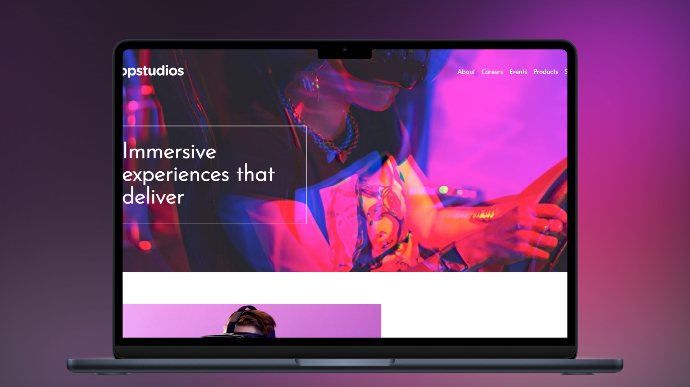

<h1 align="center">Loopstudios Landing Page 🎥</h1>

<p align="left">
  <a href="README_ES.md" target="_blank">
    Ver README en Español
  </a>
</p>

<p>This repository contains the solution for the Frontend Mentor "Loopstudios Landing Page" challenge. It’s a project designed to practice and improve CSS Grid skills, while strengthening concept knowledge in responsive design and UI.</p>
<hr>

<h1 align="center">Technologies Used</h1>
<div align="center">
  
  
</div>
<hr>

<h1 align="center">Objective</h1>
<ul>
  <li>Improve CSS Grid skills by designing a landing page.</li>
  <li>Create a responsive design that adapts to different screen sizes.</li>
  <li>Improve UI skills and semantic HTML structure.</li>
</ul>
<hr>

<h1 align="center">Main Features</h1>
<ul>
  <li>Responsive design adaptable to all devices.</li>
  <li>Effective and semantic structure with CSS Grid.</li>
  <li>Clean and modern UI following Frontend Mentor guidelines.</li>
</ul>
<hr>

<h1 align="center">Skills Acquired</h1>
<ul>
  <li>CSS Grid for complex, flexible, semantic structures.</li>
  <li>Media queries for fully responsive design.</li>
  <li>Managing images and backgrounds to create visually stunning UI.</li>
  <li>Best practices in HTML and CSS code structure.</li>
</ul>
<hr>

<h1 align="center">How to Use</h1>

1. Clone this repository to your local machine:

   ```sh
   git clone https://github.com/JordanMedinaOrtiz/loopstudios-landing-page.git
   cd loopstudios-landing-page
2. Open index.html in your browser.

<p>This challenge helped me consolidate my CSS Grid skills and improve my ability to create responsive and visually striking UI. I'll continue exploring more Frontend Mentor projects to grow my expertise.</p> <p>View the live demonstration <a href="https://jordanmedinaortiz.github.io/loopstudios-landing-page/" target="_blank">here</a>.</p>

